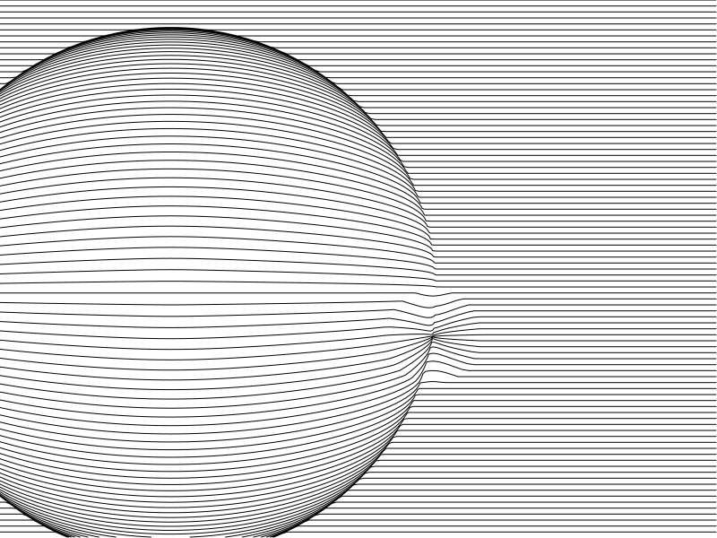
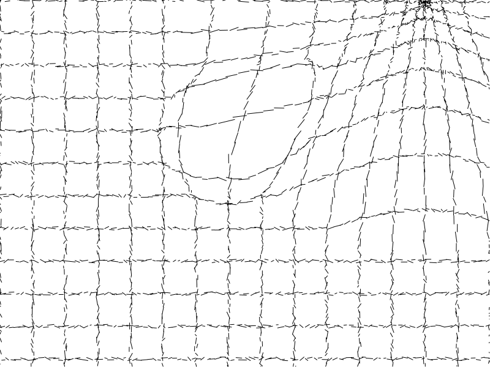
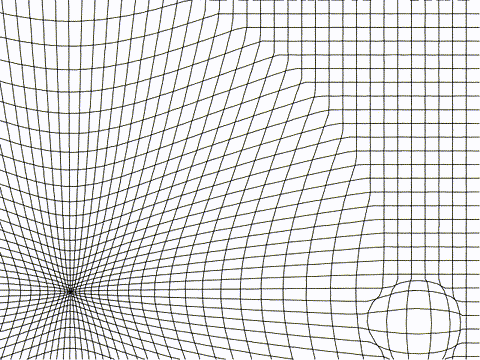

# warp-match
This project is about warping one vector graphic image to another. The image matching program will be multi-threaded and written in C.
___
svgGridGen.py is a program that can generate grid patterns. It can be used to create test images.

___

Note that it is possible to animate from one seed to another by using a floating point value for the seed parameter.

___
